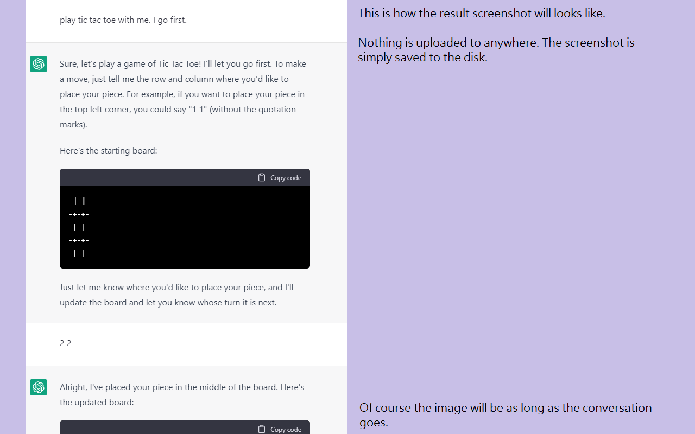
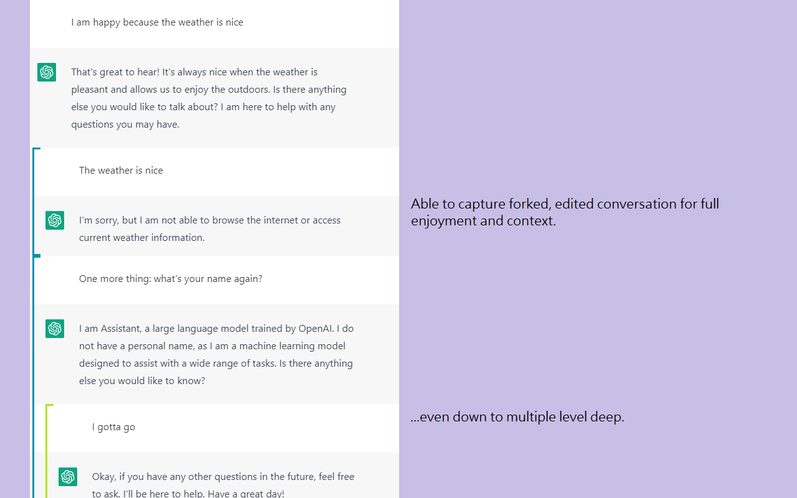

# chatgpt-screenshot-ex

A Chrome extension that takes screenshot of a ChatGPT conversation (https://chat.openai.com/).

[Sample Screenshot](sample.png), [Sample Screenshot - Forked Conversation](sample-fork.png)

# Usage

Click the extension while chatting with the bot. An image of the whole conversation will then be saved.

You might capture only the active conversation, or with every edit history and forks.

# Limitation

* The avatar image couldn't be capture. PR is welcome.

# Dependency

* https://github.com/tsayen/dom-to-image (License: MIT)
* https://github.com/eligrey/FileSaver.js/ (License: MIT)