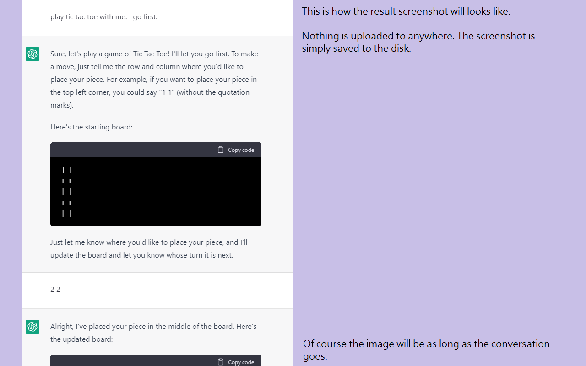
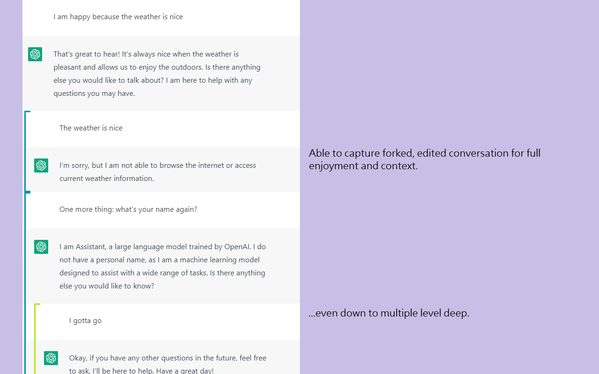
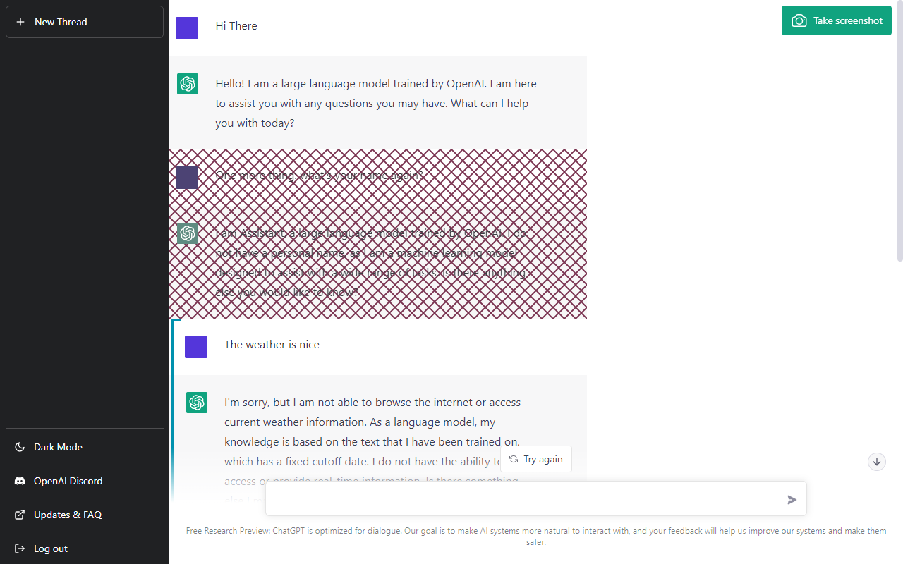
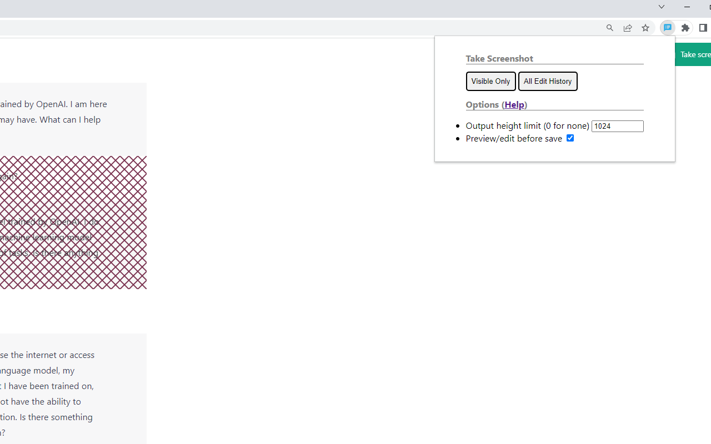
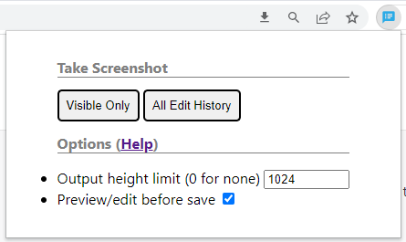
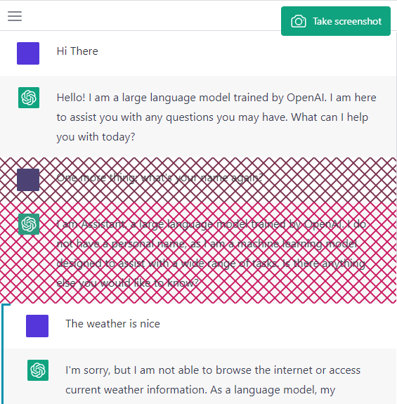

# chatgpt-screenshot-ex

A Chrome extension that takes screenshot of a ChatGPT conversation (https://chat.openai.com/). It can capture all hidden conversation branches and split long image.

Tested on version November 21, 2023.

# Sample Output and Screenshot

[Sample Screenshot](images/docs/sample.png)

[Sample Screenshot - Forked Conversation](images/docs/sample-fork.png)

# Usage

During conversation, click the extension button to bring up the options dialog.

* `Visible Only` will make a screenshot with only the visible conversation, without any edit histories.
* `All Edit History` will make a screenshot with all the histories. The alternating "timelines" are shown with color bracket appended.
* `Output height limit` will enforce a maximum upper limit for an image, splitting output into sequence of images. At least one line will be captured even under constrain.
* `Preview/edit before save` let you mask out some lines before saving.

The page will flickers a bit while the screenshots are being made.

## Preview and Edit

Once the preview mode is checked, click any of the `Take Screenshot` button, to enter preview state.

Click any of the line to cross out them. Click again to undo. Crossed lines will not be included.

Click `Reverse Selections` to quickly toggle the skipping status for all lines.

Click the `Take Screenshot` button on the upper right to compose the final screenshots.

# Limitation

* The avatar image couldn't be captured. I couldn't make `dom-to-image` works on it. PR is welcome.

# Dependency

* https://github.com/1904labs/dom-to-image-more (License: MIT)
* https://github.com/eligrey/FileSaver.js/ (License: MIT)